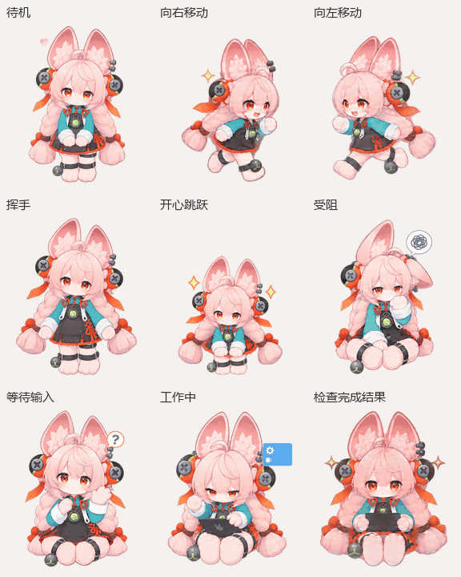

# Zhao — Native Codex v2 Pet

[简体中文](README.md)

Zhao is a pink-haired, long-eared chibi rabbit pet for Codex Desktop. The native v2 sheet includes nine animation states and sixteen gaze directions.

## Quick install: use an agent (recommended)

Copy the prompt below into an agent with network access and permission to manage local files. It downloads the native package from the Release, checks the files, and installs the pet.

```text
Please install the native Codex v2 pet “照” on this computer.

Follow these steps:
1. Identify whether this system is macOS or Windows.
2. Download and extract https://github.com/XCPeiyuan/zhao-chatgpt-pet/releases/download/v1.0.0/zhao-codex-native-v2.zip to a temporary folder.
3. Locate pet.json and spritesheet.webp. The ZIP root contains only these two files; do not use the extraction folder itself as the final pet directory.
4. Install to:
   - macOS: ~/.codex/pets/zhao/
   - Windows: %USERPROFILE%\.codex\pets\zhao\
5. Copy only pet.json and spritesheet.webp. Do not delete or modify any other pet files.
6. Verify pet.json has id zhao, spriteVersionNumber 2, and spritesheetPath spritesheet.webp; confirm spritesheet.webp exists and is readable.
7. If either destination file already exists, list the conflicting file and stop to ask whether I want it replaced. Never overwrite it without approval.
8. Report the actual install path and checks, then remind me to refresh Pets in Codex Settings and select “照”. Do not interrupt a running task; if restarting Codex is necessary, explain first and wait until current work is safe to stop.
9. If the pet remains missing after refresh on Windows, first check whether Codex Desktop is using a WSL backend. Do not edit pet.json, convert the sheet, replace spritesheet.webp, or switch backends on your own. If WSL is confirmed, explain that moving tasks to the Windows-native backend may affect workflows that depend on WSL and ask for my approval. Only after approval and once tasks are safe to stop, switch the task backend, fully quit Codex from the system tray, relaunch it, and refresh Pets. The integrated terminal can continue using WSL.
```

### Alternative methods

- [Install manually on Windows / macOS](INSTALL-en.md#manual-installation): download the Release and copy the two native files.
- [Use the Pets creation skill](INSTALL-en.md#install-through-the-pets-creation-skill): use the PNG sheet to create and select the pet in an environment supporting that plugin.

## Native pet package

- [Release package](https://github.com/XCPeiyuan/zhao-chatgpt-pet/releases/tag/v1.0.0): the archive root contains only `pet.json` and `spritesheet.webp`.
- `pet.json`: pet ID `zhao`, display name “照”, sprite version 2.
- `spritesheet.webp`: lossless WebP, 1536 × 2288 px, transparent RGBA, 8 columns × 11 rows, 192 × 208 px per cell.
- `zhao-pet-v2.png`: transparent PNG sheet for installation through the Pets creation skill.
- `sprite-sheet-map.png`: labeled row and frame map for inspection only; do not put it in the install directory.
- `look-directions.png`: neutral pose and 16 gaze directions for inspection only.
- `animation-preview.gif`: animation preview.

## Animation preview



## Sprite-sheet row map

Rows below are numbered from 1. The first nine rows are animation states; the final two contain all 16 gaze directions. Frame counts were checked against the finished sheet.

| Row | State | Frames | Meaning |
|---:|---|---:|---|
| 1 | `idle` | 6 | Idle and blinking |
| 2 | `running-right` | 8 | Hopping right |
| 3 | `running-left` | 8 | Hopping left |
| 4 | `waving` | 4 | Wave hello |
| 5 | `jumping` | 5 | Happy jump |
| 6 | `failed` | 8 | Blocked and puzzled, chin in paw |
| 7 | `waiting` | 6 | Raised hand, waiting for a reply, question bubble |
| 8 | `running` | 6 | Seated with a tablet and loading indicator |
| 9 | `review` | 6 | Reviewing results |
| 10–11 | 16 gaze directions | 8 + 8 | Clockwise, one frame every 22.5°, 000°–337.5° |


The working state uses a tablet and loading indicator, the waiting state includes a question bubble, and the blocked state includes a puzzled symbol.

## Validation

- `pet.json` parses, uses ID `zhao`, and points to the v2 sheet `spritesheet.webp`.
- The PNG source is RGBA at 1536 × 2288; its alpha channel ranges from 0 to 255 and includes truly transparent pixels.
- Decoding the WebP produces RGBA pixels identical to the PNG source; the 8 × 11 grid divides evenly into cells.
- The ZIP layout was checked and contains only `pet.json` and `spritesheet.webp`.

## Windows note

If the files are installed correctly but the pet remains missing after refreshing Pets, first check whether Codex Desktop is using a WSL backend. Do not modify `pet.json`, convert the sheet, or switch backends without approval; switching may affect workflows that depend on WSL.

## Provenance and rights

This is an unofficial, AI-assisted fan-made pet. Rights to the game, characters, names, trademarks, and related assets remain with their owners. This repository grants no license to third-party material and is not affiliated with or endorsed by HoYoverse. No general-purpose open-source license is included.
