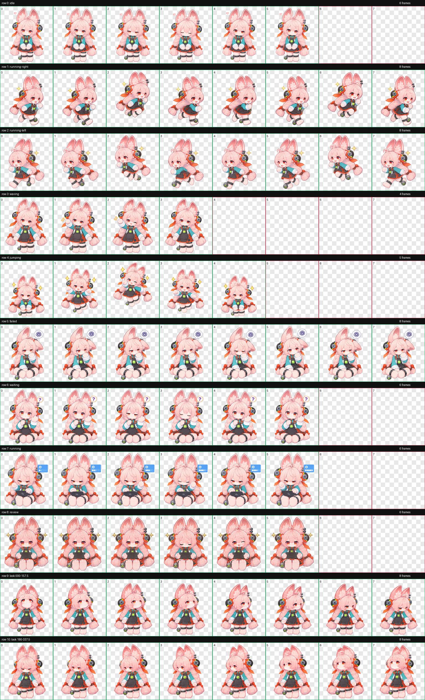
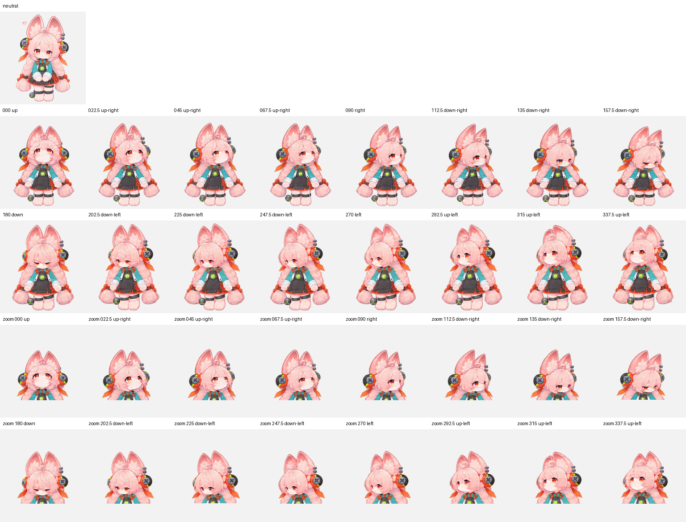

# Zhao — Native Codex v2 Pet

[简体中文](README.md)

Zhao is an animated pet asset for Codex Desktop, not a standalone app. The native package contains only `pet.json` and `spritesheet.webp`; v2 animation meanings come from the fixed sheet layout, so no text or prompt needs to be printed in the artwork.

## Quick install

1. Download [zhao-codex-native-v2.zip](https://github.com/XCPeiyuan/zhao-chatgpt-pet/releases/download/v1.0.0/zhao-codex-native-v2.zip) and extract it to a temporary folder.
2. Copy `pet.json` and `spritesheet.webp` into `%USERPROFILE%\.codex\pets\zhao\`. Do not use the temporary extraction folder itself as the pet directory.
3. Refresh Pets in Codex Settings and select “照”. If either destination file already exists, stop and inspect it instead of overwriting it.

See the [Windows / macOS installation guide in Chinese](INSTALL-zh-CN.md) or the [English guide](INSTALL-en.md). Both include a copyable agent-install prompt.

## Native pet package

- `zhao-codex-native-v2.zip`: installable archive whose root contains only `pet.json` and `spritesheet.webp`.
- `zhao-pets-upload-bundle.zip`: legacy Work Pets upload bundle, not a native Codex install; use the release above.
- `codex-native/pet.json`: pet ID `zhao`, display name “照”, sprite version 2.
- `codex-native/spritesheet.webp`: lossless WebP, 1536 × 2288 px, transparent RGBA, 8 columns × 11 rows, 192 × 208 px per cell.
- `zhao-pet-v2.png`: PNG source used for visual verification.
- `sprite-sheet-map.png`: labeled row and frame map for inspection only; do not put it in the install directory.
- `look-directions.png`: neutral pose and 16 gaze directions for inspection only.
- `animation-preview.gif`: animation preview.

## Sprite-sheet row map

Rows below are numbered from 1. The first nine rows are animation states; the final two contain all 16 gaze directions. Frame counts were checked against the finished sheet.

| Row | State | Frames | Meaning |
|---:|---|---:|---|
| 1 | `idle` | 6 | Idle and blinking |
| 2 | `running-right` | 8 | Hopping right |
| 3 | `running-left` | 8 | Hopping left |
| 4 | `waving` | 4 | Wave hello |
| 5 | `jumping` | 5 | Happy jump |
| 6 | `failed` | 8 | Blocked and puzzled, chin in paw |
| 7 | `waiting` | 6 | Raised hand, waiting for a reply, question bubble |
| 8 | `running` | 6 | Seated with a tablet and loading indicator |
| 9 | `review` | 6 | Reviewing results |
| 10–11 | 16 gaze directions | 8 + 8 | Clockwise, one frame every 22.5°, 000°–337.5° |

Zhao is a pink-haired rabbit-eared character. Her furry hands and feet have no paw pads. The work, waiting, and blocked indicators are drawn into their respective animation frames; the reference maps stay out of the install archive.

## Validation

- `pet.json` parses, uses ID `zhao`, and points to the v2 sheet `spritesheet.webp`.
- The PNG source is RGBA at 1536 × 2288; its alpha channel ranges from 0 to 255 and includes truly transparent pixels.
- Decoding the WebP produces RGBA pixels identical to the PNG source; the 8 × 11 grid divides evenly into cells.
- The ZIP layout was checked and contains only `pet.json` and `spritesheet.webp`.

## Windows note

If the files are installed correctly but the pet remains missing after refreshing Pets, first check whether Codex Desktop is using a WSL backend. Do not modify `pet.json`, convert the sheet, or switch backends without approval; switching may affect workflows that depend on WSL.

## Provenance and rights

This is an unofficial, AI-assisted fan-made pet based on character-design and in-game references supplied by the maintainer. Those reference screenshots are not redistributed here. Rights to the game, characters, names, trademarks, and related assets remain with their owners. This repository grants no license to third-party material and is not affiliated with or endorsed by HoYoverse. No general-purpose open-source license is included.
